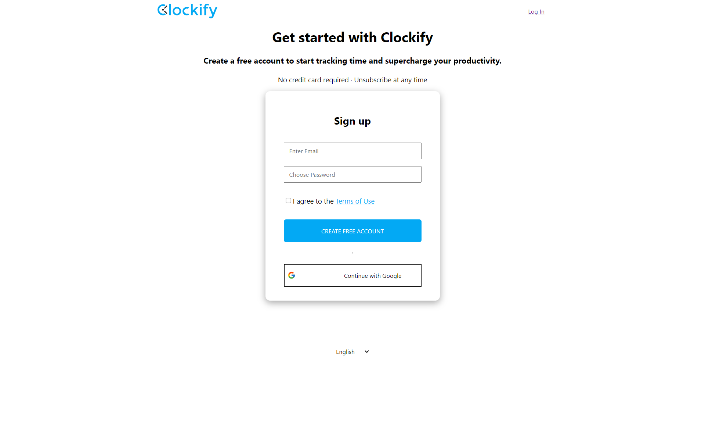
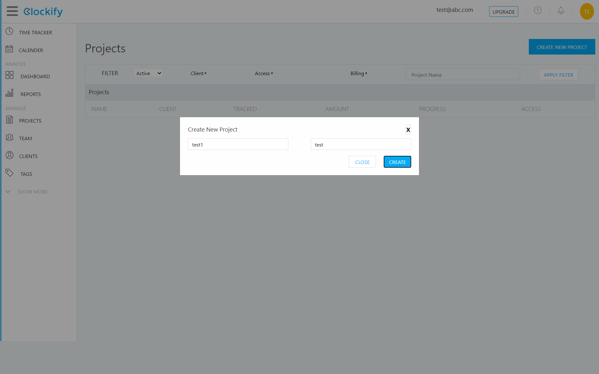

<h1>Clockify.me clone</h1>

<h4>Clockify.me is a time tracking application, where an user can keep track of time for the projects and its related management. This clone features Signup, Login, Dashboard, Project management, Payments.</h4>

<h4>This application features the following.</h4>

<h2>Home page</h2>

<h2>Signup</h2>
Where user can register with email and password

<h2>Login</h2>
User can enter the website using his registered email and password credentials.

<h2>Dashboard</h2>

<h2>Project</h2>
User can create projects, add tasks and assign them to individuals, change the settings of the project who can view. user can also change the project namein the settings.

User can add tasks to project.

User can change project name anytime

<h2>Payments</h2>
User can select and buy anyone of the available dummy subscriptions.

